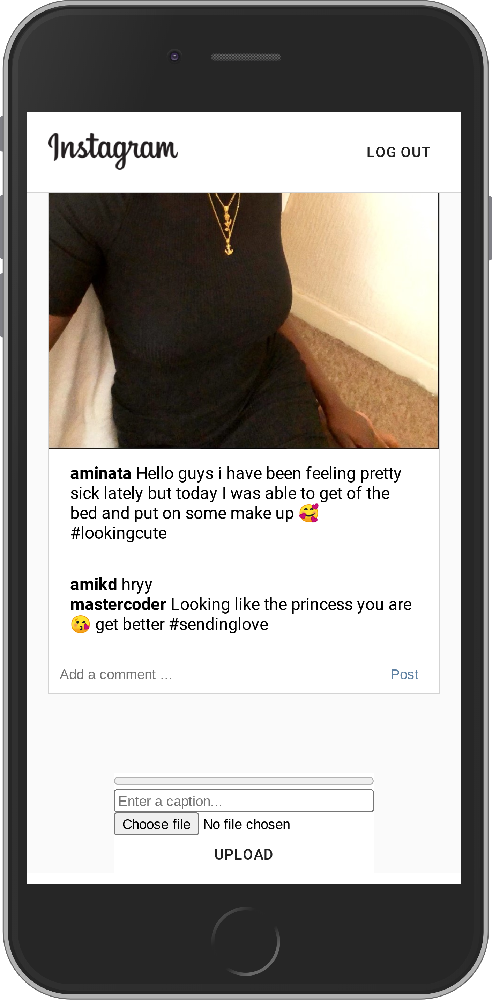

<h1>Instagram Clone React App</h1>

A basic clone of the most popular social media. It allows users to create an account, upload pictures with captions and coment under other users pictures.

<a href="https://instagram-clone-react-6703c.firebaseapp.com/" target="_blank">Deployed app</a>

<h3>Technologies used:</h3>

JavaScript, React, Firebase and Material Ui

